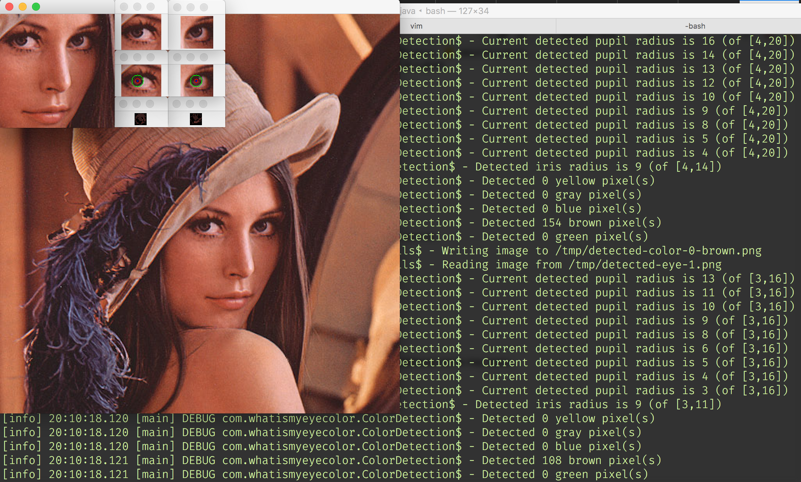

# What is my eye color?
A computer vision project that determines eye color from images of human faces.

[OpenCV](https://opencv.org) is leveraged for most of the heavy lifting.



## Requirements
- An installation of OpenCV 3.4.x+ with Java 8 compatibility (e.g. 3.4.1)
- The `OPENCV_JAVA_PATH` environment variable set to the directory which contains the installed OpenCV library

## Project structure

- [`library`](#library)
- [`cli`](#cli)
- [`gui`](#gui)
- [`share`](#share)
- [`training`](#training)

### `library`
A high-level Scala library that exposes the following capabilities:

- face detection
- eye detection
- pupil detection
- iris detection
- eye color detection
- color quantization

### `cli`
A command line interface for executing the capabilities present in the library.

An example invocation, using the sbt interactive shell, is demonstrated below. It executes the full eye color detection pipeline on an included [Lenna image](https://en.wikipedia.org/wiki/Lenna) and displays the results:
```
$ OPENCV_JAVA_PATH=/opt/local/share/OpenCV/java sbt
> project cli
> run -W all -i /images/lena.png -O /tmp
```

Please refer to the following usage doc for all currently available options:
```
Usage: wimec [GLOBAL_OPTIONS] [SUBCOMMAND] [OPTION]...

What is my eye color?

Global Options:
  -W, --window    Display graphical results in discrete windows
      --help      Show help message

Subcommand: all - Perform face, eye, pupil, iris, and eye color detection on a given image
  -E, --eye-classifier-type  <arg>    The type of classifier to use for eye
                                      detection Choices: haar
  -F, --face-classifier-type  <arg>   The type of classifier to use for face
                                      detection Choices: haar, lbp
  -i, --input  <arg>                  The local file or classpath resource that
                                      will be processed
  -O, --output-target  <arg>          The directory where resulting resources
                                      will be written
  -w, --width  <arg>
      --help                          Show help message
Subcommand: resize - Resize an image to the given width
  -i, --input  <arg>             The local file or classpath resource that will
                                 be processed
      --output-basename  <arg>   The basename of the resulting output file
  -O, --output-target  <arg>     The directory where resulting resources will be
                                 written
  -w, --width  <arg>
      --help                     Show help message
Subcommand: recolor - Reduce the number of colors used in an image to k
  -i, --input  <arg>             The local file or classpath resource that will
                                 be processed
  -k, --num-colors  <arg>
      --output-basename  <arg>   The basename of the resulting output file
  -O, --output-target  <arg>     The directory where resulting resources will be
                                 written
      --help                     Show help message
Subcommand: face - Perform face detection on a given image
  -C, --classifier-type  <arg>   The type of classifier to use for face
                                 detection Choices: haar, lbp
  -i, --input  <arg>             The local file or classpath resource that will
                                 be processed
  -O, --output-target  <arg>     The directory where resulting resources will be
                                 written
      --help                     Show help message
Subcommand: eyes - Perform eye detection on a given image of a face
  -C, --classifier-type  <arg>   The type of classifier to use for eye detection
                                 Choices: haar
  -i, --input  <arg>             The local file or classpath resource that will
                                 be processed
  -O, --output-target  <arg>     The directory where resulting resources will be
                                 written
      --help                     Show help message
Subcommand: pupil - Perform pupil detection on a given image of an eye
  -i, --input  <arg>           The local file or classpath resource that will be
                               processed
  -O, --output-target  <arg>   The directory where resulting resources will be
                               written
      --help                   Show help message
Subcommand: iris - Perform iris detection on a given image of an eye
  -i, --input  <arg>           The local file or classpath resource that will be
                               processed
  -O, --output-target  <arg>   The directory where resulting resources will be
                               written
      --help                   Show help message
Subcommand: colors - Perform eye color detection on a given image of an eye
  -i, --input  <arg>           The local file or classpath resource that will be
                               processed
  -O, --output-target  <arg>   The directory where resulting resources will be
                               written
      --help                   Show help message
```

### `gui`
*Not yet implemented*

A web application that performs eye color detection via image capture from a client's webcam.

### `share`
OpenCV Java archive.

### `training`
A command line utility used for training the eye color classifier.

Given a set of face images organized by eye color, it extracts eye images and performs color detection. Results are written to data files that can be used to train the classifer.

## Credits and notes
Face and eye detection simply defers to the LBP and Haar classifiers present in OpenCV.

Pupil center detection is largely based on [the work of Tristan Hume](http://thume.ca/projects/2012/11/04/simple-accurate-eye-center-tracking-in-opencv/), which is largely based on [the research of Timm and Barth](http://www.inb.uni-luebeck.de/publikationen/pdfs/TiBa11b.pdf).

Pupil radius and iris detection is both naive and (somewhat) novel. Both detection mechanisms search for circles originating at the pupil center. Pupil radius detection iteratively searches for the largest, darkest contour in a given search space.

Iris detection generates possible choices and decides which radius is best given the fact that if the search space extends too wide, the resulting circle will begin to accumulate white pixels since the sclera of the eye is white in color.

Eye color detection uses the OpenCV k-nearest neighbors (kNN) algorithm.

## License
Copyright (c) 2017 Jeffrey Olchovy

Published under the [MIT License](https://opensource.org/licenses/MIT), see [LICENSE](LICENSE).
